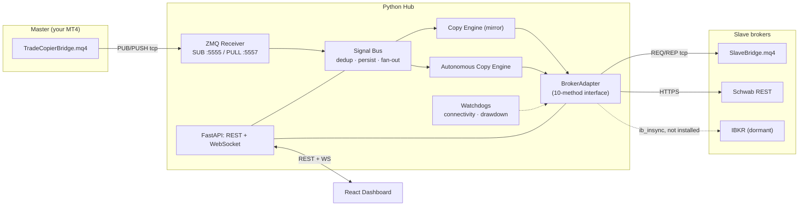

# Global Trade Copier

A self-hosted trade copier: MT4 Expert Advisors publish trade signals over
ZeroMQ, a Python hub validates and copies them to slave broker accounts,
and a React dashboard drives the whole thing live.

Two copy modes per slave:
- **Mirror** — copies the master's absolute SL/TP exactly, symbol-for-symbol. Used for MT4→MT4.
- **Autonomous** — back-calculates the master's ATR-based risk and reapplies it to the slave's own instrument, with its own sizing and breakeven/trailing logic. One master symbol can fan out to several slave instruments (e.g. an FX gold signal opening both a futures contract and an ETF). Used for MT4→Schwab, and MT4→IBKR once that adapter is activated.

## Stack

Python 3.11 · FastAPI · asyncio · pyzmq · SQLite · React + Vite · MQL4

## Architecture



**Design invariant:** Copy Engines only ever talk to a slave through the
`BrokerAdapter` interface. Swapping brokers — Schwab → IBKR — is a config
change, never an engine change.

## Repo layout

| Path | What's there |
|---|---|
| `/hub` | Python hub — FastAPI + asyncio. Signal ingestion, copy engines, broker adapters, REST/WebSocket API, hardening (retry, watchdogs, reconciliation, notifications, risk controls). |
| `/ui` | React + Vite dashboard — live activity feed, slave management, 5-step add-slave wizard, settings. |
| `/bridge_ea` | MQL4 — `TradeCopierBridge.mq4` (master) and `SlaveBridge.mq4` (slave). |
| `/deploy` | VPS deployment artifacts — provisioning script, systemd unit, nginx reverse proxy, firewall rules. |

## Quick start (local dev)

```bash
# 1. Hub
cd hub
python -m venv .venv && .venv\Scripts\activate      # Windows
pip install -r requirements.txt
python run.py                                        # don't use bare `uvicorn` on Windows -- see hub/README.md

# 2. Dashboard (separate terminal)
cd ui
npm install
npm run dev
```

Open the URL Vite prints (default `http://localhost:5173`). To exercise
the whole pipeline without a real MT4 terminal or broker account, `hub/scripts/`
has test doubles (`simulate_ea.py`, `simulate_slave.py`, `simulate_schwab.py`,
`simulate_webhook.py`) — walkthroughs for each are in `hub/README.md`.

## What's built

| Phase | Goal | Shipped |
|---|---|---|
| 1 | Signals flowing, no execution | ZMQ receiver, Signal Bus, SQLite registry, master EA stub |
| 2 | First real copy, MT4→MT4 | `BrokerAdapter` interface, `MT4Adapter`, mirror Copy Engine, `SlaveBridge.mq4` |
| 3 | Cross-asset autonomous copying | Schwab OAuth + adapter, symbol mapper, sizing engine, ATR back-calc |
| 4 | Live dashboard | REST + WebSocket API, React dashboard, add-slave wizard |
| 5 | Survive real-world conditions | Retry/backoff, watchdogs, reconciliation, real notifications, kill switch, trading hours |
| 6 | Deployment | Dormant IBKR adapter, systemd/nginx/ufw artifacts, `.env` secrets discipline |

## Documentation

- **[`hub/README.md`](hub/README.md)** — setup, full config reference (`.env` vars, `slaves.json` shape), API surface, and a step-by-step verification walkthrough for every phase's exit criterion.
- **[`ui/README.md`](ui/README.md)** — dashboard structure and an honest log of what's been browser-verified versus not.
- **[`bridge_ea/README.md`](bridge_ea/README.md)** — MQL4 setup (mql-zmq dependency), inputs reference, pointing a master EA at a remote VPS hub.
- **[`deploy/`](deploy)** — VPS provisioning, systemd service, nginx config, firewall rules. None of it has been run against a real VPS; treat the first real deploy as a first real deploy.

## Status

Verified end to end against test doubles standing in for real brokers/MT4:
the full signal path, mirror copy, autonomous fan-out with ATR sizing, the
hardening layer (retry/reconnect, watchdogs, reconciliation, kill switch,
trading hours, real webhook/email notifications), and the dashboard
(rendering, live updates, pause toggle, and the add-slave wizard clicked
through in an actual browser).

**Not verified against the real thing** — written to documented
conventions, never exercised live: the Schwab adapter's exact wire format
against a real developer account, the dormant IBKR adapter (no IBKR
account/TWS available), the MQL4 files (no MT4 terminal available; never
compiled in MetaEditor), and the `/deploy` artifacts (no VPS available).
See each subdirectory's README for the specific gaps and what to check
first.

## License

[Apache 2.0](LICENSE)
